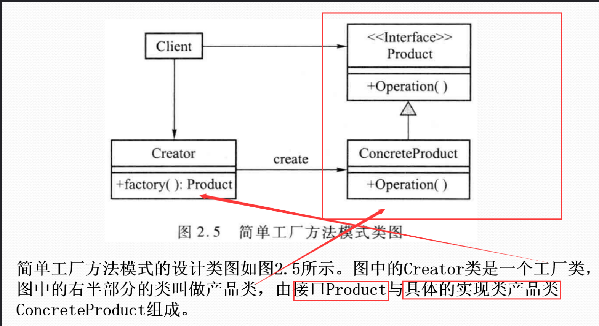

借鉴与于
https://blog.csdn.net/m0_56091756/article/details/131406458
# 学习目标
## 软件设计模式
### 概念
- 概念：
软件设计模式是对软件设计**经验的总结**，是对软件设计中常出现的问题的**成功解决方案的描述**。
- 四要素：
模式名称，问题，解决方案，效果
- 意义：
设计模式可以使设计者方便的借鉴使用 证实过的成功设计方案
### 软件设计模式有哪些呢？
**创建型 结构型 行为型**   


创建型主要用于创建对象    
结构型主要用于处理类和对象的组合  
行为型主要用于描述对类和对象怎样交互和怎样分配职责  
- 创建型软件设计模式
    - 工厂模式
    - 生成器模式
    - 单例模式
- 结构型软件设计模式
    - 组合模式
    - 适配器模式
    - 外观模式
    - 桥接模式
- 行为型软件设计模式
    - 迭代器模式
    - 访问者模式
    - 中介者模式
    - 策略模式
    - 状态模式
## 软件体系结构

## 第一个设计模式：创建型软件设计模式
### 动机 目标 内容
- 动机：有必要将创建代码的职责委托给**某一个特殊的类**
- 目标：在某些方面**增强灵活性**，哪些方面？哪个对象被创建，对象被谁创建，怎么创建，什么时候创建
- 是解决对象创建机制的设计模式，**创建和使用分离**，
### 第一个创建型设计模式：工厂模式
工厂方法和抽象工厂模式，~~有点绕口~~

#### 工厂方法模式
1.简单工厂方法模式:  
简单工厂模式专门定义一个类来负责创建其他类的实例，被创建的实例通常都具有共同的父类。可以根据参数的不同返回不同类的实例。  

```
客户端 (Client) 需要一个产品。
客户端请求工厂 (Creator) 通过调用其 factory() 方法来创建一个产品。
工厂 (Creator) 根据内部逻辑决定创建哪种具体产品 (ConcreteProduct)，并实例化它。
工厂将创建好的具体产品实例作为 Product 接口类型返回给客户端。
客户端通过 Product 接口使用这个实例，执行 Operation() 等操作，而无需关心其具体的类是 ConcreteProduct。
```
#### 抽象工厂模式


## 结构型软件设计模式


## 行为型软件设计模式